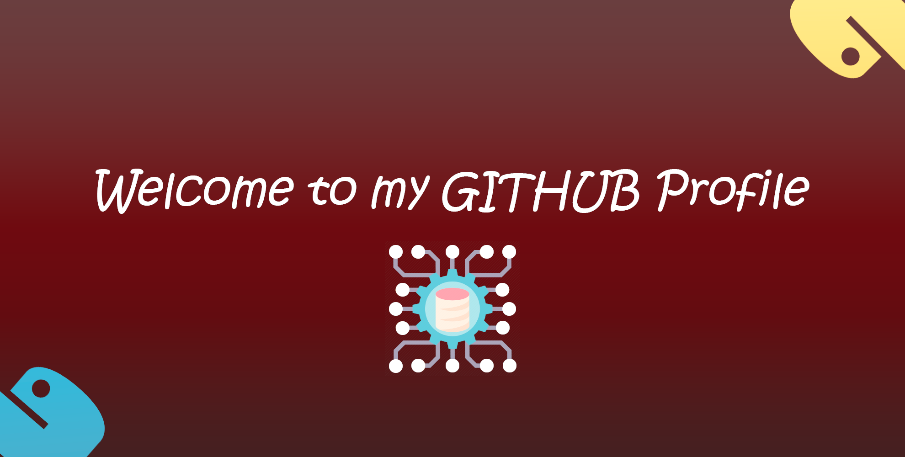

<!-- README - GITHUB PROFILE -->

<h1 align="center">Hi, I am Dorian ROUX 👨‍💻</h1>

<h2 align="center" style="font-weight:bold">AI Engineer and Data Scientist at Lincoln</h2>

<h2 align="center" style="font-weight:bold; margin-top:25px">About Me</h2>

 

  <h3 align="center" style="font-weight:bold">
    Reach me through my Networks
  </h3>
  

  </a>

  <ul>
    <li>I am currently working as a Data Scientist at Lincoln, a French consulting company who intervenes in Data related projects.</li>
    <li>I am passionate about Data Science and Development related projects where I invest myself.</li>
    <li>Finalizing my Engineering path specialized in Artificial Intelligence in End 2023.</li>
    <li>Graduated of an International Bachelor in Data Science in September 2022.</li>

<h3 align="center" style="font-weight:bold; margin-top:35px">
  My Technical Skills
</h3>

  <table style="width:100%;text-align:center">
    <tr style="border-bottom: 3px solid;">
      <th style="text-align:center">Programming Language</th>
      <th style="text-align:center">Web Development</th>
      <th style="text-align:center" >Software and Tools</th>
    </tr>  
    <tr>
      <td style="border-right: 2px solid; height:150px;width:20%">
         
        
      </td>
      <td style="border-right: 1px solid; height:150px; width:40%">
        
        
         
        
        
        
        
      </td>
      <td style="height:150px;width:40%">
        
        
        
        
        
        
        
        
         
        
      </td>
    </tr>
  </table>

  

<h2 align="center" style="font-weight:bold; margin-top:50px;">My Github Profile</h2>

 

  
  
  

<h2 align="center" style="font-weight:bold; margin-top:50px;">A Sample of My Projects</h2>

 

  <table style="width:100%;text-align:center">
    <tr>
      
    </tr>
    <tr>
      
    </tr>
    <tr>
      
    </tr>
  </table>
</dib>

